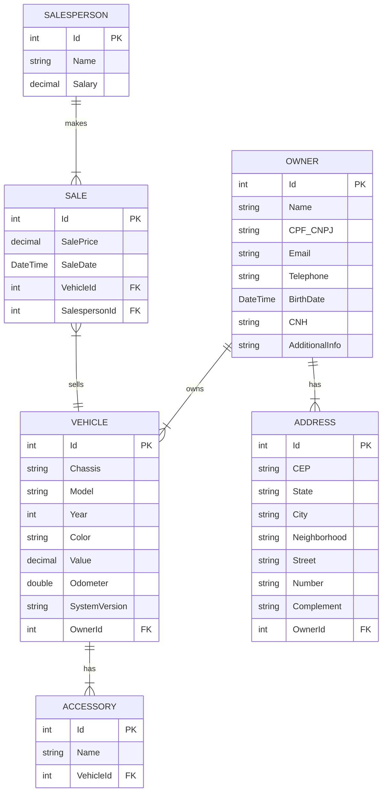

# 🚗 AutoManage API


> [!NOTE]
> 🇺🇸 **English:** RESTful API for vehicle dealership management simulation.
>
> 🇧🇷 **Português:** API RESTful para simulação de gerenciamento de concessionária de veículos.

---

## 🗺️ Database Model / Modelagem de Dados



## 🚀 Technologies / Tecnologias

*   **.NET 10.0**
*   **C#**
*   **ASP.NET Core Web API**
*   **Entity Framework Core** (SQL Server)
*   **AutoMapper**
*   **Swagger/OpenAPI**
*   **xUnit**

## ✨ Features / Funcionalidades

### 🇺🇸 English
*   **CRUD Operations**: Complete management for Vehicles, Owners, Salespeople, and Sales.
*   **Specific Filtering**: List vehicles ordered by Odometer and filtered by System Version.
*   **Sales Registration**: Register sales linking vehicles and salespeople.
*   **Commission Calculation**: Automated calculation of salesperson salary (Base + 1% of monthly sales).
*   **Complex Queries**: Data retrieval using Entity Framework `Include` for related data (e.g., Vehicle + Owner).

### 🇧🇷 Português
*   **CRUD Completo**: Gerenciamento de Veículos, Proprietários, Vendedores e Vendas.
*   **Listagem Filtrada**: Endpoint para listar veículos ordenados por quilometragem e filtrados por versão do sistema.
*   **Registro de Vendas**: Funcionalidade para registrar vendas associando veículo e vendedor.
*   **Cálculo de Comissões**: Lógica de negócio que calcula o salário final (Salário Base + 1% sobre vendas do mês).
*   **Consultas Complexas**: Retorno de dados completos usando `.Include()` (ex: Veículo + Proprietário).

## 🏃‍♂️ How to Run / Como Executar

### Prerequisites / Pré-requisitos
*   .NET 10.0 SDK
*   SQL Server (LocalDB or Docker container)

### Steps / Passo a Passo

1.  **Clone the repository / Clone o repositório**:
    ```bash
    git clone https://github.com/giovanisims/volvo.git
    cd volvo/AutoManage
    ```

2.  **Configure Database / Configure o Banco**:
    Update `appsettings.json` with your connection string.
    Atualize o `appsettings.json` com sua string de conexão.

    *Example/Exemplo:* `"Server=(localdb)\\mssqllocaldb;Database=AutoManage;Trusted_Connection=True;"`

3.  **Run Migrations / Execute Migrations**:
    ```bash
    dotnet ef database update
    ```

4.  **Start Application / Inicie a Aplicação**:
    ```bash
    dotnet run
    ```

5.  **Documentation / Documentação**:
    Access/Acesse: `http://localhost:5xxx/swagger`
