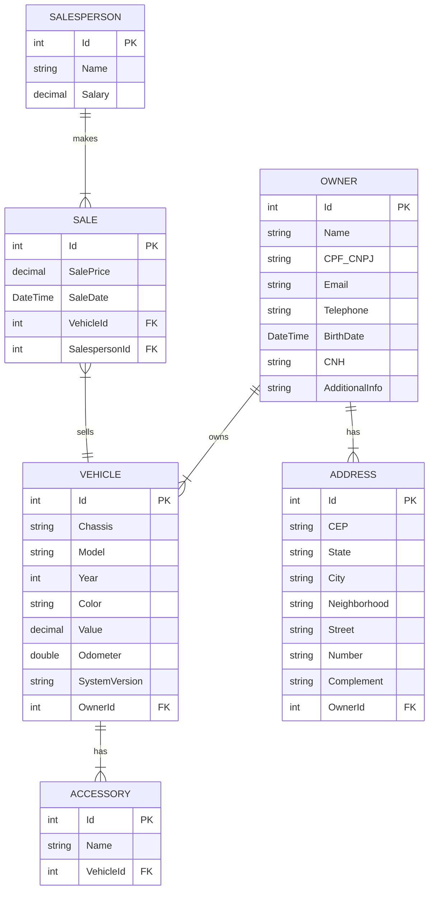

```mermaid
erDiagram
    OWNER ||--|{ VEHICLE : "owns"
    OWNER ||--|{ ADDRESS : "has"
    VEHICLE ||--|{ ACCESSORY : "has"
    SALESPERSON ||--|{ SALE : "makes"
    SALE }|--|| VEHICLE : "sells"

    OWNER {
        int Id PK
        string Name
        string CPF_CNPJ
        string Email
        string Telephone
        DateTime BirthDate
        string CNH
        string AdditionalInfo
    }

    ADDRESS {
        int Id PK
        string CEP
        string State
        string City
        string Neighborhood
        string Street
        string Number
        string Complement
        int OwnerId FK
    }

    VEHICLE {
        int Id PK
        string Chassis
        string Model
        int Year
        string Color
        decimal Value
        double Odometer
        string SystemVersion
        int OwnerId FK
    }

    ACCESSORY {
        int Id PK
        string Name
        int VehicleId FK
    }

    SALESPERSON {
        int Id PK
        string Name
        decimal Salary
    }

    SALE {
        int Id PK
        decimal SalePrice
        DateTime SaleDate
        int VehicleId FK
        int SalespersonId FK
    }
```
